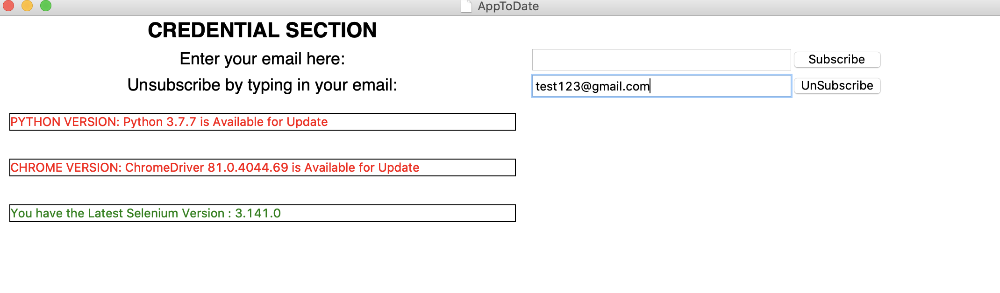
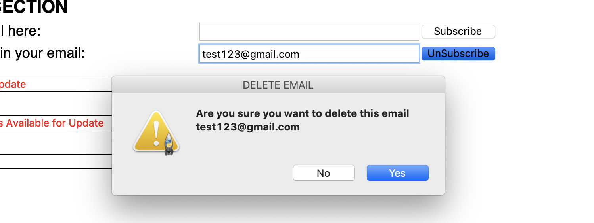
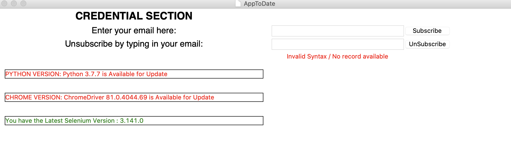

# AppToDate

GUI application that notifies subscribed users for any latest updates of the following technology stack:
- Python Version
- Selenium Version
- Chrome Version

Users can subscribe and recieve emails if any new updates are available, users can aslo unsubscribe to stop recieving emails


# Installation
 1. Download and install Python3
 2. Download the required packages by typing:
 ```bash
pip install -r requirements.txt
```
 3. Download Chrome Webdriver from <a href="https://chromedriver.chromium.org/downloads">here</a>
 4. Navigate to this section of the code and replace to your Chrome Webdriver Path
``` python
self.driver = webdriver.Chrome("INSERT DRIVER PATH HERE", options=self.options)
```

# Usage

- Type the below command to run the Application. You need to be connected to the Internet and it might take 1-5 minutes to gather the latest updates/versions from the internet so please wait patiently.
``` python
python program.py
```


- The GUI page that shows up once the application is done loading, at the left side it displays the information in rows, the green text and message indicates that there is no new available update, while the red text and message indicate that there is a new available update.


- To recieve updates via email, input your email in the subscribe section and click on <b>subscribe</b> as shown and start recieving updates on email!


- To stop recieving emails, navigate to the <b>unsubscribe</b> field and input your email and click on <b>unsubscribe</b>





- You would be prompted to confirm to delete, click <b>Yes</b> to delete the email





- If you mispell your email while unsubscribing you would recieve an error as such below, just retype your email carefully and it should unsubscribe.





        

 
 
 
 
 
        
